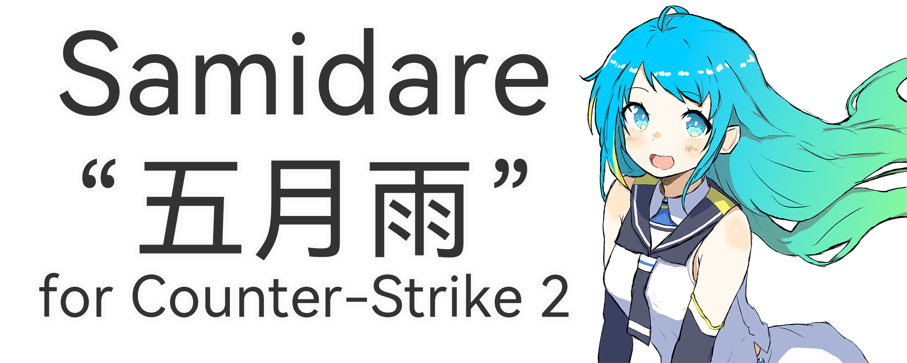

*"五月雨を集めて早し最上川"*
## Feature 
- Use Native APIs to OpenProcess/WPM/RPM/MouseEvent (Ring3) and CreateWindow
- Inplement WPM/RPM/MouseEvent in kernel-mode (Ring0)
- Multithread
- Basic imgui Overlay/Menu
- Overlay at most top with uiaccess(which allows you overlay while game in full-screen mode, but some bugs need to resolve)
- Automatic change exe file hash with .bat eachtime run/exit
- Basic config system with yaml-cpp
- Customizable i18n system with yaml-cpp
- Random title with 风花雪月
- Visible check with vphys parser
- Auto teamcheck with cvar finder
- Bypass Capture ability
## Functions

<details>
<summary>Legit</summary>
  
- Customizable Aim Assist
- Customizable Triggerbot
- Customizable RCS
</details>

<details>
<summary>Visuals</summary>
  
- Customizable player ESP
- Bomb ESP
- Customizable Radar
</details>

<details>
<summary>Miscs</summary>

- Sonar
- Pitch indicator
- Bomb timer with damage calculation
- Spectator List
- Closest Enemy info
- Fast stop
</details>

<details>
<summary>Settings</summary>
  
- Build Info
- Config Saver
- Force Team Check Switch
- Bypass Capture
</details>

<details>
<summary>Experimental</summary>
  
- Performances Settings
</details>

## Related
- [UkiaRPM](https://github.com/M3351AN/UkiaRPM) as start point.
- [Vphys-Parser-Online](https://github.com/M3351AN/Vphys-Parser-Online)
- [mouse_input_injection](https://github.com/M3351AN/mouse_input_injection) (Ring3)
- [Usugumo](https://github.com/M3351AN/Usugumo) (Ring0)
- [Shirakumo](https://github.com/M3351AN/Shirakumo) (Ring3 FIFO)
## Credits
- [3A1(Z3bra)](https://github.com/3a1/) for his CS1.6 hack [Evelion](https://github.com/3a1/Evelion)
- [ekknod](https://github.com/ekknod/) for his CS2 pen-test [EC](https://github.com/ekknod/EC)
- [IMXNOOBX](https://github.com/IMXNOOBX/) for his [cs2-external-esp](https://github.com/IMXNOOBX/cs2-external-esp)
- [AtomicBool(AtomicBoolean)](https://github.com/AtomicBool/) for his [cs2-map-parser](https://github.com/AtomicBool/cs2-map-parser)
- [TKazer(Liv)](https://github.com/TKazer) for his [CS2_External](https://github.com/TKazer/CS2_External)
- [TKazer(Liv)](https://github.com/TKazer),[Vekor64(CowNow)](https://github.com/Vekor64/),Shinyaluvs,[oakboat](https://github.com/oakboat/),[Me"M3351AN(渟雲)"](https://github.com/M3351AN) ...and many others who ever contribute to [Aimstar](https://github.com/M3351AN/AimStar)
- Friendly users on UC that ever helps me
- [ocornut(omar)](https://github.com/ocornut/) for his [Dear ImGui](https://github.com/ocornut/imgui)
- [killtimer0(killtimer)](https://github.com/killtimer0/) for his [uiaccess](https://github.com/killtimer0/uiaccess)
- [Barracudach(Evgeny)](https://github.com/Barracudach/) for his [CallStack-Spoofer](https://github.com/Barracudach/CallStack-Spoofer)
- [TheCruZ](https://github.com/TheCruZ/) for his [kdmapper](https://github.com/TheCruZ/kdmapper)
- [oakboat](https://github.com/oakboat/) for his [RTCore64_Vulnerability](https://github.com/oakboat/RTCore64_Vulnerability)
- [jbeder(Jesse Beder)](https://github.com/jbeder/) for his [yaml-cpp](https://github.com/jbeder/yaml-cpp)
- [nlohmann(Niels Lohmann)](https://github.com/nlohmann/) for his [json](https://github.com/nlohmann/json)
- [nothings(Sean Barrett)](https://github.com/nothings/) for his [stb](https://github.com/nothings/stb)
- [richgel999(Rich Geldreich)](https://github.com/richgel999/) for his [miniz](https://github.com/richgel999/miniz)
- Huawei Device Co., Ltd. for their [HarmonyOS Sans Fonts](https://developer.huawei.com/consumer/en/doc/design-guides-V1/font-0000001157868583-V1) ([LICENCE](HARMONYOSSANS字体许可协议))
- [舰娘百科(zh.kcwiki.cn)](https://zh.kcwiki.cn/wiki/%E8%88%B0%E5%A8%98%E7%99%BE%E7%A7%91) for some images licenced under [CC BY-NC-SA 4.0](https://creativecommons.org/licenses/by-nc/4.0/)
- [DeepSeek R1](https://github.com/deepseek-ai/DeepSeek-R1) for cleaning my sh1t code
- CHINA TOBACCO GUANGXI INDUSTRIAL CO., LTD. for magics
## License

This project is licensed under [**TOSSRCU**](LICENSE).
```diff
+ You are free to:
	• Use: Utilize the software for any purpose not explicitly restricted
	• Copy: Reproduce the software without limitation
	• Modify: Create derivative works through remixing/transforming
	• Merge: Combine with other materials
	• Publish: Display/communicate the software publicly
	• Distribute: Share copies of the software

+ Under the following terms:
	• Attribution: Must include copyright notice and this license in all copies
	• Non-Commercial: Cannot use for commercial activities "as is" without written permission
	• Waifu Clause: Don't consider the author as your waifu

- You are not allowed to:
	• Sublicense: Cannot grant sublicenses for original/modified material
	• Commercial Use: Prohibited from monetization "as is" without explicit permission

```
- This project contains codes released into [**the public domain**](https://unlicense.org/).
- This project contains codes licensed under [**The MIT License**](https://opensource.org/license/mit).
- This project contains codes licensed under [**CC BY-NC-SA 4.0**](https://creativecommons.org/licenses/by-nc/4.0/).
- This project contains HarmonyOS Sans Fonts licensed under [**HARMONYOSSANS字体许可协议**](HARMONYOSSANS字体许可协议).
- This project contains images & texts licensed under [**CC BY-NC-SA 4.0**](https://creativecommons.org/licenses/by-nc/4.0/).
